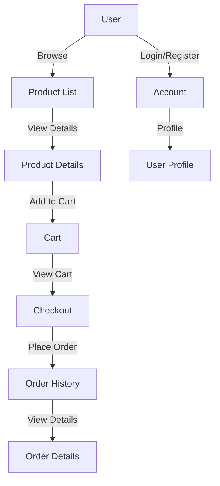

# Project Flowchart

.../
list.html (Food menu)
detail.html (Food item details)
add.html (Add new food)
cart/
view.html (View cart)
checkout.html (Checkout)
order/
history.html (Order history)
detail.html (Order details)
account/
login.html (User login)
register.html (User registration)
profile.html (User profile)
---
**Note:**
Some template folders/files listed above (like `food/`, `cart/`, etc.) do not currently exist in your project structure. For better organization, you can create these folders inside your templates directory and add the corresponding HTML files:

- `.../`: `list.html`, `detail.html`, `add.html`
- `cart/`: `view.html`, `checkout.html`
- `order/`: `history.html`, `detail.html`
- `account/`: `login.html`, `register.html`, `profile.html`

This will help keep your templates organized and easy to manage.

========================whene create model========================
   pip install python-dotenv
   
   python manage.py makemigrations
   python manage.py migrate
================ 
   "python -m pip install Pillow"

A Product model (with fields like name, description, price, image, etc.)
A view to fetch and pass product data to the template
A template that loops through products and displays them
==================================
whene create models

python manage.py makemigrations
python manage.py migrate

==============================================

